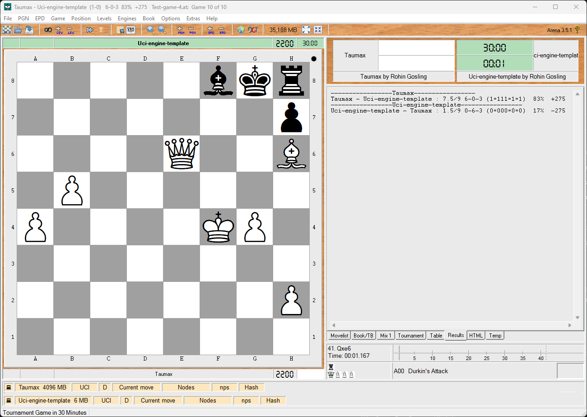

# Taumax - UCI Chess Engine

[](https://www.rust-lang.org/)
[](https://doc.rust-lang.org/cargo/)
[](https://www.shredderchess.com/chess-info/features/uci-universal-chess-interface.html)

<div align="center">
  
  <div align="right"><i><b>Taumax</b> vs. random-move reference engine, after 10-game tournament (8 wins, 2 draws).</i></div>
</div>

<br>

**Taumax** is a UCI-compliant chess engine written in Rust, that explores the ideas expressed by *Alex Wissner-Gross's*, causal entropic intelligence equation.

$$
\mathbf{F} = T \nabla S_{\tau}
$$

The goal of **Taumax** is not to be a strong chess engine, but instead, to explore ways in which causal entropy may be applied to an adversarial context, like the game of Chess. 

## 📚 Contents

- [✅ Requirements](#requirements)
- [🏟️ Install In Arena](#install-in-arena)
- [⚙️ Engine Options](#engine-options)
- [🔌 Supported UCI Commands](#supported-uci-commands)
- [🛠️ Build From Source](#build-from-source)
- [🚀 GPU Acceleration](#gpu-acceleration)
- [🧠 How Move Selection Works](#how-move-selection-works)
- [🎯 Expected Gameplay Behavior](#expected-gameplay-behavior)
- [♟️ Applying Causal Entropy to the Game of Chess](#applying-causal-entropy-to-the-game-of-chess)
- [🧭 Troubleshooting](#troubleshooting)
- [📄 License](#license)


<br>

<a id="requirements" name="requirements"></a>

## ✅ Requirements

- To run **Taumax**, all you need is a **UCI** compatible Chess UI. For example, **Arena**.
- To build from source, you will need **Rust**, and **Cargo**.

***Note:** The engine has no graphical interface, opening book, tablebase support, network service, async runtime, or GPL dependency.*

<br>

<a id="install-in-arena" name="install-in-arena"></a>

## 🏟️ Install In Arena

1. Download the release executable, or build from source.
2. Open Arena.
3. Install a new engine.
4. Select `taumax.exe`, or `target\release\taumax.exe` if you built from source.
5. Choose UCI if Arena asks for the protocol.
6. Open the engine configuration dialog and set any Taumax options you want to use.
7. Start a game or analysis session.

Arena launches Taumax as a command-line UCI process. Commands flow into standard input, and protocol
responses such as `uciok`, `readyok`, `info string`, and `bestmove` flow back through standard
output.

<br>

<a id="engine-options" name="engine-options"></a>

## ⚙️ Engine Options

Taumax advertises its configurable options during the UCI handshake. Arena shows these in the engine
configuration dialog.

| Option | Type | Default | Meaning |
|---|---:|---:|---|
| `Strategy` | combo | `Random` | Selects `Random` or `RelativeCausalEntropy` |
| `Max Depth` | spin | `6` | Maximum relative-future horizon in plies |
| `Random Seed` | string | empty | Optional deterministic seed for reproducible random-control runs |
| `Diagnostics Trace` | check | `false` | Emits score and profile diagnostics through UCI `info string` lines |
| `GPU Acceleration` | check | `false` | Requests optional GPU leaf evaluation with CPU fallback |

Example Arena-style configuration commands:

```text
setoption name Strategy value RelativeCausalEntropy
setoption name Max Depth value 5
setoption name Diagnostics Trace value true
setoption name GPU Acceleration value true
```

`GPU Acceleration` is always available in the current `taumax.exe`. Leave it unchecked for normal CPU
leaf evaluation, or check it to request GPU leaf evaluation with automatic CPU fallback.

The UCI `go depth N` limit is also supported. When both `go depth` and `Max Depth` are present,
`RelativeCausalEntropy` uses:

$$
\tau_{\mathrm{eff}} = \min(\tau_{\max}, N_{\mathrm{go}})
$$

where `Max Depth` is the GUI-configured cap and `N_go` is the depth supplied by the `go` command.

`go searchmoves ...` restricts candidate root moves, and `go movetime N` creates a cooperative
search deadline. The `stop` command uses the same cancellation path.

<br>

<a id="supported-uci-commands" name="supported-uci-commands"></a>

## 🔌 Supported UCI Commands

| Command | Behavior |
|---|---|
| `uci` | Prints engine identity, option lines, and `uciok` |
| `isready` | Prints `readyok` |
| `ucinewgame` | Resets the session to the starting position |
| `position startpos` | Sets the board to the standard starting position |
| `position startpos moves ...` | Sets the start position and applies each UCI move |
| `position fen ...` | Sets the board from FEN |
| `position fen ... moves ...` | Sets the FEN position and applies each UCI move |
| `go ...` | Starts configured move selection and prints one legal `bestmove` |
| `stop` | Requests cooperative cancellation and returns the best move found so far |
| `debug on`, `debug off` | Toggles diagnostic logging to standard error |
| `setoption ...` | Applies known engine options and ignores unknown options for GUI compatibility |
| `quit` | Exits cleanly |

Standard output is reserved for UCI protocol text. Diagnostics and debug messages go to standard
error so chess GUIs never try to parse logs as engine responses.

Invalid `position` commands are rejected as a whole. The previous valid position is retained, and a
diagnostic is written to standard error.

<br>

<a id="build-from-source" name="build-from-source"></a>

## 🛠️ Build From Source

From the project root, build the release executable:

```powershell
cargo build --release
```

The Windows executable is created at:

```text
target/release/taumax.exe
```

This single executable contains the full UCI option surface, including `GPU Acceleration`. The option
defaults to `false`, so the engine uses CPU leaf evaluation unless the user enables GPU acceleration
from the chess GUI.

<br>

<a id="gpu-acceleration" name="gpu-acceleration"></a>

## 🚀 GPU Acceleration

GPU acceleration is optional and default-off inside `taumax.exe`. Enable it from Arena or another UCI
GUI by setting:

```text
setoption name GPU Acceleration value true
```

GPU use is limited to the relative leaf-evaluation backend. Legal move generation, UCI handling, root
move control, and most search orchestration remain CPU-side. If no compatible GPU backend is
available, or if GPU execution fails, Taumax automatically falls back to CPU leaf evaluation.

Use `Diagnostics Trace=true` to see what happened:

```text
info string tau profile strategy=RelativeCausalEntropy acceleration=serial-cpu leafBackend=gpu-batch gpuRequested=yes ...
```

`gpuRequested=yes` means the GUI requested GPU use. `leafBackend=gpu-batch` means GPU leaf work
actually ran. `leafBackend=cpu-batch` means the request fell back to CPU.

GPU execution may not improve performance on every machine or position. The checkbox is a runtime
request, not a guarantee that GPU work will run for every search.


<br>

<a id="how-move-selection-works" name="how-move-selection-works"></a>

## 🧠 How Move Selection Works

Taumax currently exposes two active strategies.

| Strategy | Purpose | Behavior |
|---|---|---|
| `Random` | Control condition | Uniformly selects one legal root move; reproducible when `Random Seed` is set |
| `RelativeCausalEntropy` | Causal-entropic selector | Scores legal root moves by future relative freedom after the opponent's most restrictive reply |

`RelativeCausalEntropy` does not use material values, piece-square tables, opening books, tablebases,
trained networks, or hand-written tactical motifs. It measures legal action-space structure instead.

The selector estimates future freedom using:

- Taumax legal-move mobility.
- Taumax per-piece mobility.
- Opponent legal-move mobility as a future restriction pressure.
- Opponent per-piece mobility as a finer restriction pressure.
- A finite search horizon controlled by `Max Depth` and `go depth`.
- An adversarial reply model where the opponent chooses the reply that minimizes Taumax's future
  relative entropy.
- Explicit terminal-state boundaries for checkmate, being checkmated, and stalemate.

The terminal policy is important. In an adversarial environment, checkmating the opponent is the
strongest guarantee that the opponent cannot restrict future movement. Taumax therefore treats a
checkmating terminal state as a high future-agency boundary, being checkmated as a low boundary, and
stalemate or drawn terminal states as their own neutral boundary. These are game-ending agency
conditions, not material scores or mate-distance heuristics.

With `Diagnostics Trace=true`, a relative search emits root-score lines and one profile line. The profile line
shows the acceleration path, leaf backend, GPU request state, node and leaf counts, batch shape,
terminal count, and elapsed microseconds.


<br>

<a id="expected-gameplay-behavior" name="expected-gameplay-behavior"></a>

## 🎯 Expected Gameplay Behavior

Because Taumax is maximizing a relative future-freedom estimate rather than chess material, it can
look unusual compared with conventional engines.

You should expect:

- Legal moves, not necessarily strong chess moves.
- Central or piece-activating moves when they increase future mobility.
- Captures when removing an opponent piece improves Taumax's relative future freedom.
- Rejected captures when the capture lets the opponent severely restrict Taumax afterward.
- Moves that reduce the opponent's future mobility even without winning material.
- Terminal wins to be attractive because they remove the opponent's future ability to restrict play.
- Terminal losses to be strongly avoided when any agency-preserving alternative exists.
- Stalemate to be treated differently from checkmate.

The useful question when watching Taumax is not "did it win material?" but "did this move preserve
or expand Taumax's future freedom while reducing the opponent's ability to constrain it?"


<br>

<a id="applying-causal-entropy-to-the-game-of-chess" name="applying-causal-entropy-to-the-game-of-chess"></a>

## ♟️ Applying Causal Entropy to the Game of Chess

Alex Wissner-Gross's causal entropic intelligence equation describes a force toward futures with
greater causal entropy:

$$
\mathbf{F} = T \nabla S_{\tau}
$$

Taumax applies the same idea to chess by treating the current board position as the state $s$ and
each legal root move $m \in \mathcal{M}(s)$ as a possible direction from that state. The horizon
$\tau$ is the finite number of plies used to estimate future freedom.

After move $m$ is played, Taumax estimates the causal entropy of the resulting future:

$$
S_{\tau}(s,m) = \widehat{H}_{\tau}(s_m)
$$

Here, $s_m$ is the position reached by move $m$, and $\widehat{H}_{\tau}(s_m)$ is Taumax's estimate
of the future action space that remains available after adversarial replies within horizon $\tau$.

In the original equation, $\nabla S_{\tau}$ is the gradient of future entropy. Chess is discrete, so
Taumax uses a move-wise entropy difference instead of a continuous spatial gradient:

$$
\Delta_m S_{\tau}(s) = S_{\tau}(s,m) - B_{\tau}(s)
$$

where $B_{\tau}(s)$ is the baseline future-freedom estimate for the root position. This gives each
candidate move its own chess analogue of entropic force:

$$
\begin{aligned}
F_m &= T \Delta_m S_{\tau}(s) \\
    &= T \left(S_{\tau}(s,m) - B_{\tau}(s)\right)
\end{aligned}
$$

Taumax then chooses from the legal moves with the greatest entropic pressure:

$$
m^* \in \arg\max_{m \in \mathcal{M}(s)} F_m
$$

In practical chess terms, $S_{\tau}$ is future freedom, $\nabla S_{\tau}$ becomes the comparison
between legal move directions, $T$ controls how strongly entropy differences shape preference, and
$\mathbf{F}$ becomes the pressure toward moves that preserve or expand Taumax's agency. Checkmate is
treated as a high terminal boundary because it removes the opponent's future action space; being
checkmated is treated as a low terminal boundary; stalemate is treated as a distinct game-ending
boundary.

<br>

<a id="troubleshooting" name="troubleshooting"></a>

## 🧭 Troubleshooting

| Symptom | What To Check |
|---|---|
| Arena does not show `GPU Acceleration` | Arena is loading an older executable; reload the current `taumax.exe`, or rebuild with `cargo build --release` and select `target\release\taumax.exe` |
| Arena shows only `Strategy`, `Max Depth`, `Random Seed`, and `Diagnostics Trace` | Arena is loading an older executable; remove the old engine entry and select the current `taumax.exe` |
| Arena still shows old `Tau*` option names | Arena is loading an older executable; remove the old engine entry or point Arena to the current `target\release\taumax.exe` |
| `GPU Acceleration=true` still reports `leafBackend=cpu-batch` | GPU execution was requested but unavailable or failed at runtime; Taumax falls back to CPU leaf evaluation |
| Search is slow | Lower `Max Depth`, use `go depth`, or try `Random` first |
| Moves look strange | This is expected for causal-entropic move selection; inspect `Diagnostics Trace=true` output |
| No `bestmove` appears | Check that Arena installed the engine as UCI, then reload the executable |

<br>

<a id="license" name="license"></a>

## 📄 License

Released under the [MIT License](LICENSE). Copyright (c) 2024 Rohin Gosling.
